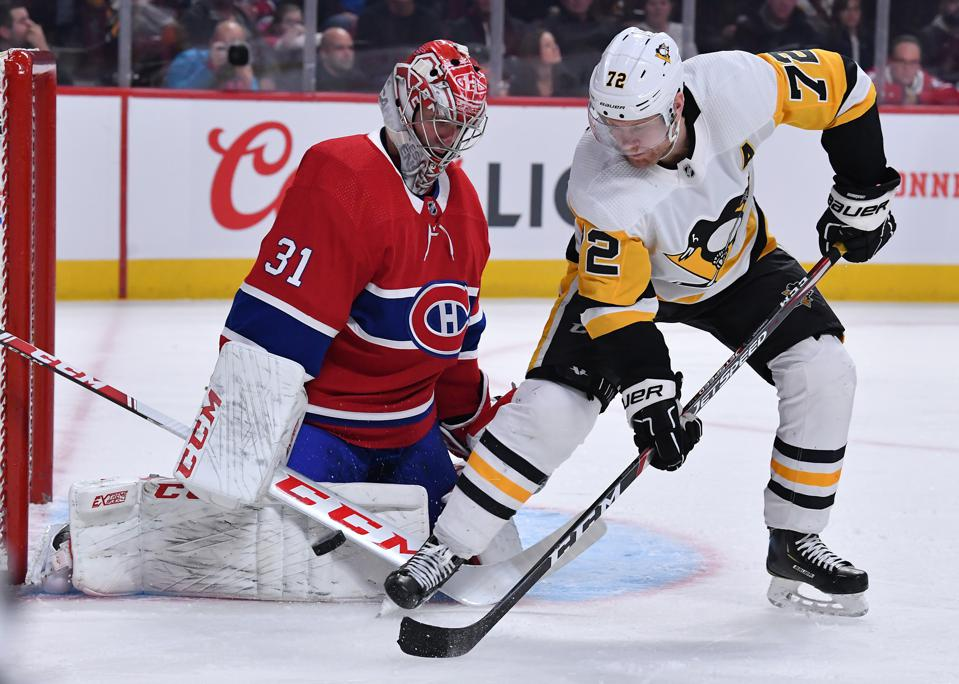
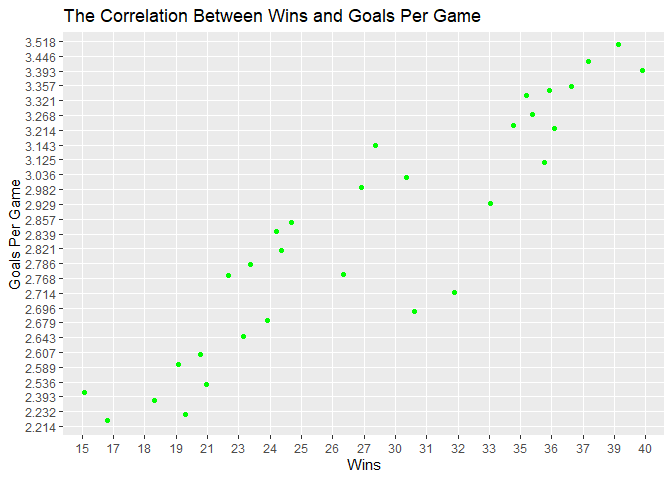
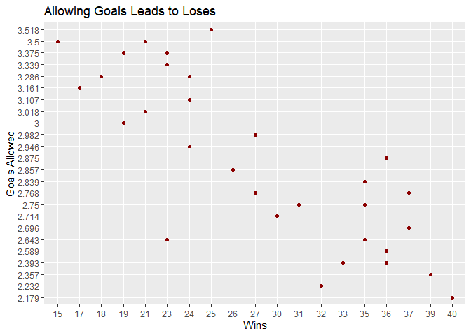
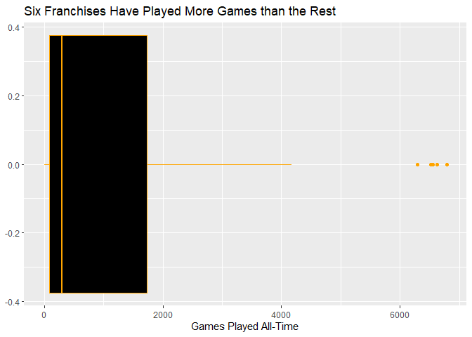
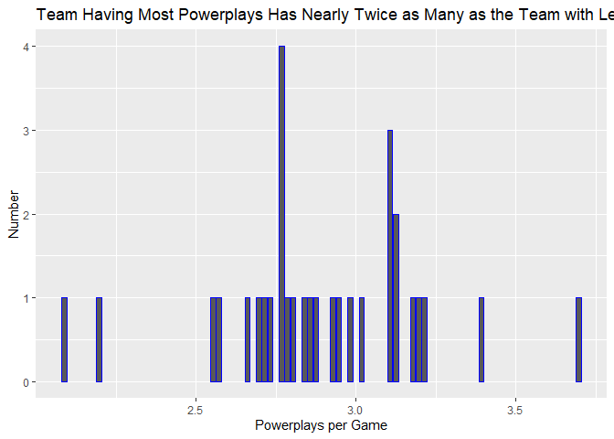
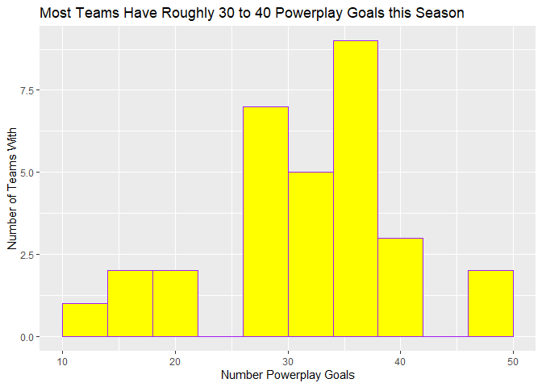

-   [Introduction](#introduction)
    -   [Required Packages](#required-packages)
    -   [This Vignette](#this-vignette)
    -   [The functions](#the-functions)
    -   [Pulling Data](#pulling-data)
    -   [The Graphs](#the-graphs)

    knitr::opts_chunk$set(fig.path='Figs/')

    knitr::opts_chunk$set(echo = TRUE, include = TRUE)
    #install.packages("httr")
    #install.packages("jsonlite")
    require(httr)
    require(jsonlite)
    require(ggplot2)
    require(tidyr)
    require(dplyr)

Introduction
============

Required Packages
-----------------

The following packages are required for running this Vignette: -httr
-jsonlite -ggplot2 -tidyr -dplyr

This Vignette
-------------

This vignette discusses a function that was produced to allow for the
relatively easy querying of the NHL records and stats API’s. These API’s
have statistics and information, both current and historical, for all
the teams that are currently in or were once a part of the
[NHL](https://www.nhl.com/). It also discusses some of the plotting that
can be done using this information. This is what an NHL player looks
like courtesy of the NHL:  
 The above is some close-to-the-goal action between
the goalie and offensive player of opposing teams. Similarly to soccer,
the goalie in hockey can touch the puck with more of their body than can
the average player, at least when they are right near the goal (which
they usually but not always are)

The functions
-------------

    NHL_records <- function(team_or_id = NULL, specifier = NULL){
    ## start with the URL that begins every API call
    base_url <- "https://records.nhl.com/site/api"
    ## if the user inputs "franchise," append the base URL with the /franchise modifier to return the full historical dataset of team names
      if(identical(team_or_id, "franchise")){
        base_url <- paste0(base_url, "/franchise")
      }
      if(identical(team_or_id, "stats")){
        base_url <- paste0(base_url, "/franchise-team-totals")
      }
      ## mapping all of the team names to their respective franchise ID numbers
      if(identical(team_or_id, "New Jersey Devils")){
        team_or_id <- 23
      }
      if(identical(team_or_id, "New York Islanders")){
        team_or_id <- 22
      }
      if(identical(team_or_id, "New York Rangers")){
        team_or_id <- 10
      }
      if(identical(team_or_id, "Philadelphia Flyers")){
        team_or_id <- 16
      }
      if(identical(team_or_id, "Pittsburgh Penguins")){
        team_or_id <- 17
      }
      if(identical(team_or_id, "Boston Bruins")){
        team_or_id <- 6
      }
      if(identical(team_or_id, "Buffalo Sabres")){
        team_or_id <- 19
      }
      if(identical(team_or_id, "Montreal Canadiens")){
        team_or_id <- 1
      }
      if(identical(team_or_id, "Ottawa Senators")){
        team_or_id <- 30
      }
      if(identical(team_or_id, "Toronto Maple Leafs")){
        team_or_id <- 5
      }
      if(identical(team_or_id, "Carolina Hurricanes")){
        team_or_id <- 26
      }
      if(identical(team_or_id, "Florida Panthers")){
        team_or_id <- 33
      }
      if(identical(team_or_id, "Tampa Bay Lightning")){
        team_or_id <- 31
      }
      if(identical(team_or_id, "Washington Capitals")){
        team_or_id <- 24
      }
      if(identical(team_or_id, "Chicago Blackhawks")){
        team_or_id <- 11
      }
      if(identical(team_or_id, "Detroit Redwings")){
        team_or_id <- 12
      }
      if(identical(team_or_id, "Nashville Predators")){
        team_or_id <- 34
      }
      if(identical(team_or_id, "St. Lious Blues")){
        team_or_id <- 18
      }
      if(identical(team_or_id, "Calgary Flames")){
        team_or_id <- 21
      }
      if(identical(team_or_id, "Colorado Avalanche")){
        team_or_id <- 27
      }
      if(identical(team_or_id, "Edmonton Oilers")){
        team_or_id <- 25
      }
      if(identical(team_or_id, "Vancouver Canucks")){
        team_or_id <- 20
      }
      if(identical(team_or_id, "Anaheim Ducks")){
        team_or_id <- 32
      }
      if(identical(team_or_id, "Dallas Stars")){
        team_or_id <- 15
      }
      if(identical(team_or_id, "Los Angeles Kings")){
        team_or_id <- 14
      }
      if(identical(team_or_id, "San Jose Sharks")){
        team_or_id <- 29
      }
      if(identical(team_or_id, "Columbus Blue Jackets")){
        team_or_id <- 36
      }
      if(identical(team_or_id, "Minnesota Wild")){
        team_or_id <- 37
      }
      if(identical(team_or_id, "Winnipeg Jets")){
        team_or_id <- 35
      }
      if(identical(team_or_id, "Arizona Coyotes")){
        team_or_id <- 28
      }
      if(identical(team_or_id, "Vegas Golden Knights")){
        team_or_id <- 38
      }
      if(identical(team_or_id, "Seattle Kraken")){
        team_or_id <- 39
      }

    ##if the user only enters a number or team name
      if(is.numeric(team_or_id) && is.na(specifier)){
        base_url <- paste0(base_url, "/franchise-season-records?cayenneExp=franchiseId=", team_or_id)
      } 
    ## the user specifies goalie and skater records
      if(is.numeric(team_or_id) && identical(specifier, "goalie")){
        base_url <- paste0(base_url, "/franchise-goalie-records?cayenneExp=franchiseId=", team_or_id)
      }
      if(is.numeric(team_or_id) && identical(specifier, "skater")){
        base_url <- paste0(base_url, "/franchise-skater-records?cayenneExp=franchiseId=", team_or_id)
      }
    #the user says admin to see retired numbers, etc.
      if(is.numeric(team_or_id) && identical(specifier, "admin")){
        base_url <- paste0(base_url, "/franchise-detail?cayenneExp=mostRecentTeamId=", team_or_id)
      }

      
    ## if the user puts in a word other than those specified above, return a message telling the user it was a bad input
    ## 
      #Make the API call and get the data into a nice form
      data_1 <- GET(base_url)
      data_2 <- content(data_1, "text", encoding = "UTF-8")
      data_3 <- fromJSON(data_2, flatten = TRUE)
      data_4 <- as.data.frame(data_3)
      data_5 <- tibble(data_4)
      return(data_5)
    }

Similarly for this NHL *stats* API, one can simply put in the team ID to
get a break down of a particular teams season stats. These stats are for
the current season.

    NHL_stats <- function(id){
      ##start with the base URL's that are the beginning and the end of all the API calls
    base_url_2 <- "https://statsapi.web.nhl.com/api/v1/teams/"
    ending_url <- "?expand=team.stats"
    # put them together with the inputted user number in the middle
    base_url_2 <- paste0(base_url_2, id, ending_url)
    #need to allow user to request information for all the teams
    if(identical(id, "all")){
      base_url_2 <- "https://statsapi.web.nhl.com/api/v1/teams?expand=team.stats"
    }
    #sequence of actions to take data from the API and return it in a nicer form
      data_1 <- GET(base_url_2)
      data_2 <- content(data_1, "text", encoding = "UTF-8")
      data_3 <- fromJSON(data_2, flatten = TRUE)
      data_4 <- as.data.frame(data_3)
      data_5 <- tibble(data_4)
      data_6 <- unnest(unnest(data_5,cols = c(teams.teamStats)),cols = c(splits))
      return(data_6)
    }

In some cases, the output from NHL\_stats or NHL\_records is not in
exactly the form you would expect, so I also built a function that
simply pings the API and gets a tibble of data, without trying to unpack
it in a particular way.

    #the user simply indicates which API they are wanting to query with a modifier word
    wrapper <- function(id, modifier){
      if(identical(modifier, "records")){
        return(NHL_records(id))
        }
      if(identical(modifier, "stats")){
        return(NHL_stats(id))
      }
      
      }

Pulling Data
------------

Now that we have our underlying functions, NHL\_records and NHL\_stats,
and our wrapper function that simply calls each of them given the
appropriate input, it is time to actually start pulling some data. First
I will grab the return for the stats API for the New Jersey Devils.

    ###start actually pulling some data

    New_Jersey <- wrapper(1, "stats")
    New_Jersey

    ## # A tibble: 2 x 65
    ##   copyright            teams.id teams.name   teams.link teams.abbreviat~ teams.teamName
    ##   <chr>                   <int> <chr>        <chr>      <chr>            <chr>         
    ## 1 NHL and the NHL Shi~        1 New Jersey ~ /api/v1/t~ NJD              Devils        
    ## 2 NHL and the NHL Shi~        1 New Jersey ~ /api/v1/t~ NJD              Devils        
    ## # ... with 59 more variables: teams.locationName <chr>, teams.firstYearOfPlay <chr>,
    ## #   stat.gamesPlayed <int>, stat.wins <chr>, stat.losses <chr>, stat.ot <chr>,
    ## #   stat.pts <chr>, stat.ptPctg <chr>, stat.goalsPerGame <chr>,
    ## #   stat.goalsAgainstPerGame <chr>, stat.evGGARatio <chr>,
    ## #   stat.powerPlayPercentage <chr>, stat.powerPlayGoals <chr>,
    ## #   stat.powerPlayGoalsAgainst <chr>, stat.powerPlayOpportunities <chr>,
    ## #   stat.penaltyKillPercentage <chr>, stat.shotsPerGame <chr>,
    ## #   stat.shotsAllowed <chr>, stat.winScoreFirst <chr>, stat.winOppScoreFirst <chr>,
    ## #   stat.winLeadFirstPer <chr>, stat.winLeadSecondPer <chr>,
    ## #   stat.winOutshootOpp <chr>, stat.winOutshotByOpp <chr>, stat.faceOffsTaken <chr>,
    ## #   stat.faceOffsWon <chr>, stat.faceOffsLost <chr>, stat.faceOffWinPercentage <chr>,
    ## #   stat.shootingPctg <dbl>, stat.savePctg <dbl>, stat.penaltyKillOpportunities <chr>,
    ## #   stat.savePctRank <chr>, stat.shootingPctRank <chr>, team.id <int>,
    ## #   team.name <chr>, team.link <chr>, type.displayName <chr>, type.gameType.id <chr>,
    ## #   type.gameType.description <chr>, type.gameType.postseason <lgl>,
    ## #   teams.shortName <chr>, teams.officialSiteUrl <chr>, teams.franchiseId <int>,
    ## #   teams.active <lgl>, teams.venue.name <chr>, teams.venue.link <chr>,
    ## #   teams.venue.city <chr>, teams.venue.timeZone.id <chr>,
    ## #   teams.venue.timeZone.offset <int>, teams.venue.timeZone.tz <chr>,
    ## #   teams.division.id <int>, teams.division.name <chr>, teams.division.link <chr>,
    ## #   teams.conference.id <int>, teams.conference.name <chr>,
    ## #   teams.conference.link <chr>, teams.franchise.franchiseId <int>,
    ## #   teams.franchise.teamName <chr>, teams.franchise.link <chr>

This output has all kinds of statistics for this season for the New
Jersey Devils including losses, goals and even derived statistics such
as goals per game. The problem with this is that we only have
information for New Jersey!

What I would like to do with these functions is compare stats across
teams and find some correlations and interesting representations of
data. To do this we will call our wrapper function, specify “stats,” and
request “all” to get data for all the teams. The function does a great
job unpacking the data (it begins with a doubly nested data object), but
it does leave in the rankings for each stat for the 31 teams. I just
want the raw numbers, so I will filter out all rows for which “games
played” is na. This is an effective way to do it because for all of the
rows that contain rank information, the stat for games played is na,
whereas for the raw information the games played stat has what you would
expect: the number of games each team has played.

    motherload <- wrapper("all", "stats")
    head(motherload)

    ## # A tibble: 6 x 66
    ##   copyright            teams.id teams.name   teams.link teams.abbreviat~ teams.teamName
    ##   <chr>                   <int> <chr>        <chr>      <chr>            <chr>         
    ## 1 NHL and the NHL Shi~        1 New Jersey ~ /api/v1/t~ NJD              Devils        
    ## 2 NHL and the NHL Shi~        1 New Jersey ~ /api/v1/t~ NJD              Devils        
    ## 3 NHL and the NHL Shi~        2 New York Is~ /api/v1/t~ NYI              Islanders     
    ## 4 NHL and the NHL Shi~        2 New York Is~ /api/v1/t~ NYI              Islanders     
    ## 5 NHL and the NHL Shi~        3 New York Ra~ /api/v1/t~ NYR              Rangers       
    ## 6 NHL and the NHL Shi~        3 New York Ra~ /api/v1/t~ NYR              Rangers       
    ## # ... with 60 more variables: teams.locationName <chr>, teams.firstYearOfPlay <chr>,
    ## #   stat.gamesPlayed <int>, stat.wins <chr>, stat.losses <chr>, stat.ot <chr>,
    ## #   stat.pts <chr>, stat.ptPctg <chr>, stat.goalsPerGame <chr>,
    ## #   stat.goalsAgainstPerGame <chr>, stat.evGGARatio <chr>,
    ## #   stat.powerPlayPercentage <chr>, stat.powerPlayGoals <chr>,
    ## #   stat.powerPlayGoalsAgainst <chr>, stat.powerPlayOpportunities <chr>,
    ## #   stat.penaltyKillPercentage <chr>, stat.shotsPerGame <chr>,
    ## #   stat.shotsAllowed <chr>, stat.winScoreFirst <chr>, stat.winOppScoreFirst <chr>,
    ## #   stat.winLeadFirstPer <chr>, stat.winLeadSecondPer <chr>,
    ## #   stat.winOutshootOpp <chr>, stat.winOutshotByOpp <chr>, stat.faceOffsTaken <chr>,
    ## #   stat.faceOffsWon <chr>, stat.faceOffsLost <chr>, stat.faceOffWinPercentage <chr>,
    ## #   stat.shootingPctg <dbl>, stat.savePctg <dbl>, stat.penaltyKillOpportunities <chr>,
    ## #   stat.savePctRank <chr>, stat.shootingPctRank <chr>, team.id <int>,
    ## #   team.name <chr>, team.link <chr>, type.displayName <chr>, type.gameType.id <chr>,
    ## #   type.gameType.description <chr>, type.gameType.postseason <lgl>,
    ## #   teams.shortName <chr>, teams.officialSiteUrl <chr>, teams.franchiseId <int>,
    ## #   teams.active <lgl>, teams.venue.name <chr>, teams.venue.link <chr>,
    ## #   teams.venue.city <chr>, teams.venue.id <int>, teams.venue.timeZone.id <chr>,
    ## #   teams.venue.timeZone.offset <int>, teams.venue.timeZone.tz <chr>,
    ## #   teams.division.id <int>, teams.division.name <chr>, teams.division.link <chr>,
    ## #   teams.conference.id <int>, teams.conference.name <chr>,
    ## #   teams.conference.link <chr>, teams.franchise.franchiseId <int>,
    ## #   teams.franchise.teamName <chr>, teams.franchise.link <chr>

    #taking out the rows that contain rank information
    motherload <- motherload %>% filter(!is.na(stat.gamesPlayed))
    head(motherload)

    ## # A tibble: 6 x 66
    ##   copyright            teams.id teams.name   teams.link teams.abbreviat~ teams.teamName
    ##   <chr>                   <int> <chr>        <chr>      <chr>            <chr>         
    ## 1 NHL and the NHL Shi~        1 New Jersey ~ /api/v1/t~ NJD              Devils        
    ## 2 NHL and the NHL Shi~        2 New York Is~ /api/v1/t~ NYI              Islanders     
    ## 3 NHL and the NHL Shi~        3 New York Ra~ /api/v1/t~ NYR              Rangers       
    ## 4 NHL and the NHL Shi~        4 Philadelphi~ /api/v1/t~ PHI              Flyers        
    ## 5 NHL and the NHL Shi~        5 Pittsburgh ~ /api/v1/t~ PIT              Penguins      
    ## 6 NHL and the NHL Shi~        6 Boston Brui~ /api/v1/t~ BOS              Bruins        
    ## # ... with 60 more variables: teams.locationName <chr>, teams.firstYearOfPlay <chr>,
    ## #   stat.gamesPlayed <int>, stat.wins <chr>, stat.losses <chr>, stat.ot <chr>,
    ## #   stat.pts <chr>, stat.ptPctg <chr>, stat.goalsPerGame <chr>,
    ## #   stat.goalsAgainstPerGame <chr>, stat.evGGARatio <chr>,
    ## #   stat.powerPlayPercentage <chr>, stat.powerPlayGoals <chr>,
    ## #   stat.powerPlayGoalsAgainst <chr>, stat.powerPlayOpportunities <chr>,
    ## #   stat.penaltyKillPercentage <chr>, stat.shotsPerGame <chr>,
    ## #   stat.shotsAllowed <chr>, stat.winScoreFirst <chr>, stat.winOppScoreFirst <chr>,
    ## #   stat.winLeadFirstPer <chr>, stat.winLeadSecondPer <chr>,
    ## #   stat.winOutshootOpp <chr>, stat.winOutshotByOpp <chr>, stat.faceOffsTaken <chr>,
    ## #   stat.faceOffsWon <chr>, stat.faceOffsLost <chr>, stat.faceOffWinPercentage <chr>,
    ## #   stat.shootingPctg <dbl>, stat.savePctg <dbl>, stat.penaltyKillOpportunities <chr>,
    ## #   stat.savePctRank <chr>, stat.shootingPctRank <chr>, team.id <int>,
    ## #   team.name <chr>, team.link <chr>, type.displayName <chr>, type.gameType.id <chr>,
    ## #   type.gameType.description <chr>, type.gameType.postseason <lgl>,
    ## #   teams.shortName <chr>, teams.officialSiteUrl <chr>, teams.franchiseId <int>,
    ## #   teams.active <lgl>, teams.venue.name <chr>, teams.venue.link <chr>,
    ## #   teams.venue.city <chr>, teams.venue.id <int>, teams.venue.timeZone.id <chr>,
    ## #   teams.venue.timeZone.offset <int>, teams.venue.timeZone.tz <chr>,
    ## #   teams.division.id <int>, teams.division.name <chr>, teams.division.link <chr>,
    ## #   teams.conference.id <int>, teams.conference.name <chr>,
    ## #   teams.conference.link <chr>, teams.franchise.franchiseId <int>,
    ## #   teams.franchise.teamName <chr>, teams.franchise.link <chr>

I also would like to look at some historical statistics, which we again
will pull using our wrapper function.

    #"stats" is used as a modifier and as input into records
    franchises <- wrapper("stats", "records")

The Graphs
----------

The first thing I would like to look at is how well scoring correlates
with winning. To look at that I am going to bring up a scatterplot of
wins and goals.

    scatter <- ggplot(motherload, aes(stat.wins, stat.goalsPerGame,))
    scatter + geom_jitter(color = "green") + xlab("Wins") + ylab("Goals Per Game") + ggtitle("The Correlation Between Wins and Goals Per Game")

 As expected, we can see that wins and goals
per game are highly correlated. In fact, they are even more highly
correlated than I would have thought a priori. In basketball and
football, for instance, it is frequently the case that there is a great
offensive team with a poor overall record. This is not the case here as
is easily seen by the fact that there are no dots high up on the graph
that appear on the left half. We can see that, in fact, the top four
winningest teams are in the top five in scoring! It would appear in
hockey that the best offense is a good offense, and perhaps even like
the old adage the best defense is a good offense!

    scatter2 <- ggplot(motherload, aes(stat.wins, stat.goalsAgainstPerGame))
    scatter2 + geom_point(color = "darkred") + xlab("Wins") + ylab("Goals Allowed") + ggtitle("Allowing Goals Leads to Loses")

 Of course we don’t want to let offense have all
the fun! We look at the other side of the puck with this scatter plot as
we plot wins versus the number of goals a team’s opponent scores. I
expected these two values to be negatively correlated, which they are. I
would make the case, though, that in fact offense predominates in hockey
because there are a few very good defensive teams that are not elite
from a total wins perspective.

Now that I have a little bit of an understanding of how offense and
defense impact winning in hockey, I would like to get some historical
understanding of the different franchises and thus the history of the
league. I would like to look at a boxplot of the total games played by
each franchise.

    box <- ggplot(franchises, aes(data.gamesPlayed))
    box + geom_boxplot(color = "orange", fill = "black") + xlab("Games Played All-Time") + ggtitle("Six Franchises Have Played More Games than the Rest")

 This is very interesting to look at! One can
instantly understand a little bit about the history of the NHL from one
simple graph. Most franchises in the NHL have had less than 2000 games
in their history, while there are six that have over six thousand! This
makes me wonder if those six franchises are the founding members of the
NHL. There are two statistics missing from the season statistics that I
am interested in: face off’s taken per game, and power play
opportunities per game. I will create these new variables by appending
them to my table called “motherload.”

    ## create new per game stats by dividing by games played. Note that power play opportunities and face offs taken, though they are numbers, are coded as characters so I will need to coerce it to an int.
    motherload$stat.powerPlayOpportunities <- as.numeric(motherload$stat.powerPlayOpportunities)

    motherload$stat.gamesPlayed <- as.numeric(motherload$stat.gamesPlayed)

    motherload$stat.faceOffsTaken <- as.numeric(motherload$stat.faceOffsTaken)
    #now actually calculate our new statistics
    face_power <- motherload %>% mutate(faceoffs_perGame = stat.faceOffsTaken / stat.gamesPlayed)

    face_power <- face_power %>% mutate(powerplays_pergame = stat.powerPlayOpportunities/ stat.gamesPlayed)

    head(face_power)

    ## # A tibble: 6 x 68
    ##   copyright            teams.id teams.name   teams.link teams.abbreviat~ teams.teamName
    ##   <chr>                   <int> <chr>        <chr>      <chr>            <chr>         
    ## 1 NHL and the NHL Shi~        1 New Jersey ~ /api/v1/t~ NJD              Devils        
    ## 2 NHL and the NHL Shi~        2 New York Is~ /api/v1/t~ NYI              Islanders     
    ## 3 NHL and the NHL Shi~        3 New York Ra~ /api/v1/t~ NYR              Rangers       
    ## 4 NHL and the NHL Shi~        4 Philadelphi~ /api/v1/t~ PHI              Flyers        
    ## 5 NHL and the NHL Shi~        5 Pittsburgh ~ /api/v1/t~ PIT              Penguins      
    ## 6 NHL and the NHL Shi~        6 Boston Brui~ /api/v1/t~ BOS              Bruins        
    ## # ... with 62 more variables: teams.locationName <chr>, teams.firstYearOfPlay <chr>,
    ## #   stat.gamesPlayed <dbl>, stat.wins <chr>, stat.losses <chr>, stat.ot <chr>,
    ## #   stat.pts <chr>, stat.ptPctg <chr>, stat.goalsPerGame <chr>,
    ## #   stat.goalsAgainstPerGame <chr>, stat.evGGARatio <chr>,
    ## #   stat.powerPlayPercentage <chr>, stat.powerPlayGoals <chr>,
    ## #   stat.powerPlayGoalsAgainst <chr>, stat.powerPlayOpportunities <dbl>,
    ## #   stat.penaltyKillPercentage <chr>, stat.shotsPerGame <chr>,
    ## #   stat.shotsAllowed <chr>, stat.winScoreFirst <chr>, stat.winOppScoreFirst <chr>,
    ## #   stat.winLeadFirstPer <chr>, stat.winLeadSecondPer <chr>,
    ## #   stat.winOutshootOpp <chr>, stat.winOutshotByOpp <chr>, stat.faceOffsTaken <dbl>,
    ## #   stat.faceOffsWon <chr>, stat.faceOffsLost <chr>, stat.faceOffWinPercentage <chr>,
    ## #   stat.shootingPctg <dbl>, stat.savePctg <dbl>, stat.penaltyKillOpportunities <chr>,
    ## #   stat.savePctRank <chr>, stat.shootingPctRank <chr>, team.id <int>,
    ## #   team.name <chr>, team.link <chr>, type.displayName <chr>, type.gameType.id <chr>,
    ## #   type.gameType.description <chr>, type.gameType.postseason <lgl>,
    ## #   teams.shortName <chr>, teams.officialSiteUrl <chr>, teams.franchiseId <int>,
    ## #   teams.active <lgl>, teams.venue.name <chr>, teams.venue.link <chr>,
    ## #   teams.venue.city <chr>, teams.venue.id <int>, teams.venue.timeZone.id <chr>,
    ## #   teams.venue.timeZone.offset <int>, teams.venue.timeZone.tz <chr>,
    ## #   teams.division.id <int>, teams.division.name <chr>, teams.division.link <chr>,
    ## #   teams.conference.id <int>, teams.conference.name <chr>,
    ## #   teams.conference.link <chr>, teams.franchise.franchiseId <int>,
    ## #   teams.franchise.teamName <chr>, teams.franchise.link <chr>,
    ## #   faceoffs_perGame <dbl>, powerplays_pergame <dbl>

I would like to now take our newly created powerplays\_pergame statistic
and plot it on a bar plot to see the different teams side by side.

    ##create plot and add bar plot layer
    bar <- ggplot(face_power, aes(powerplays_pergame))
    bar + geom_bar(color = "blue") + xlab("Powerplays per Game") + ylab("Number") + ggtitle("Team Having Most Powerplays Has Nearly Twice as Many as the Team with Least")

 Wow check this out! Most teams have between 2.5
and 3.25 Powerplays per game but the one with the most has going on 4
Powerplays per game. The fact that on the professional level, one team
can generate nearly twice the Powerplays of another is interesting. Find
out what a Powerplay is below.

I don’t know a whole lot about hockey, but one thing I have picked up
from the few games I have watched is that Powerplay goals are very
important. This is when one team has one more player on the ice than the
other because of a foul one team committed. Let’s look at a histogram
showing the number of teams with different ranges of Powerplay goals.

    motherload$stat.powerPlayGoals <- as.numeric(motherload$stat.powerPlayGoals)
    hist <- ggplot(motherload, aes(stat.powerPlayGoals))
    hist + geom_histogram(binwidth = 4, color = "purple", fill = "yellow") + xlab("Number Powerplay Goals") + ylab("Number of Teams With") + ggtitle("Most Teams Have Roughly 30 to 40 Powerplay Goals this Season")

 You can see that some teams have as few as 10
power play goals while others have about 50 and most teams have around
30. Once again, a range of 10-50 for any statistic in sports strikes me
as being highly variable - one team has 5 times the power play goals!

I’d like to explore how many franchises are active NHL franchises and
how many franchises are historical/previously active NHL franchises.

    franchises$data.activeFranchise <- as.factor(franchises$data.activeFranchise)
    table(franchises$data.activeFranchise)

    ## 
    ##  0  1 
    ## 18 87

Whether the database intends to be using 0 as active or 1 as active,
something has gone awry here because I know there are 31 active
franchises, hence more than 18 and less than 87. Looking at the data it
appears that 1 is meant to be active and 0 is meant to be historical,
the problem is just that we have some confusing duplication in the data.

One statistic that is bound to matter a lot in hockey is shooting
percentage, what percentage of shots go in. As a way of looking how that
varies between teams I am going to look at a numerical summary of it.

    summ <- summary(motherload$stat.shootingPctg)
    summ

    ##    Min. 1st Qu.  Median    Mean 3rd Qu.    Max. 
    ##   8.200   9.000   9.500   9.665  10.350  11.500

We can see that the lowest shooting percentage is 8.2 and the highest is
11.5 with a mean of 9.665. To think that 33 more shots out of 1000 go in
for the most accurate team than the least accurate, that is a big
difference in number of goals made per thousand shots!
